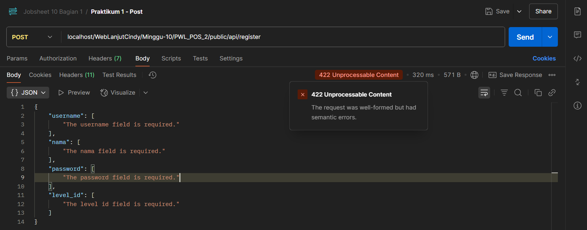
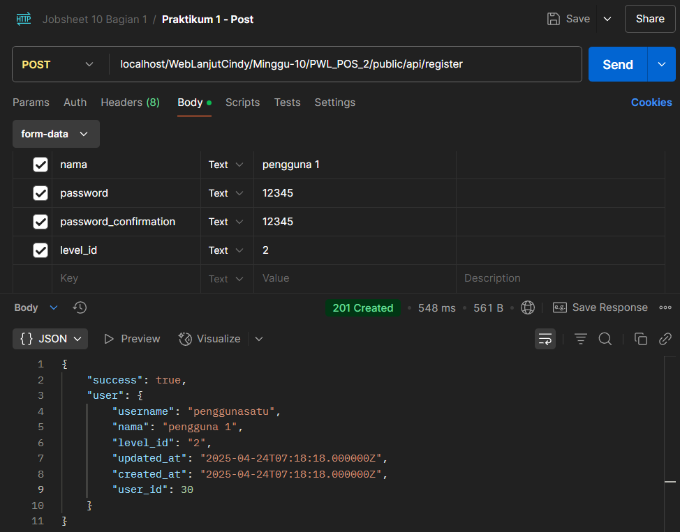
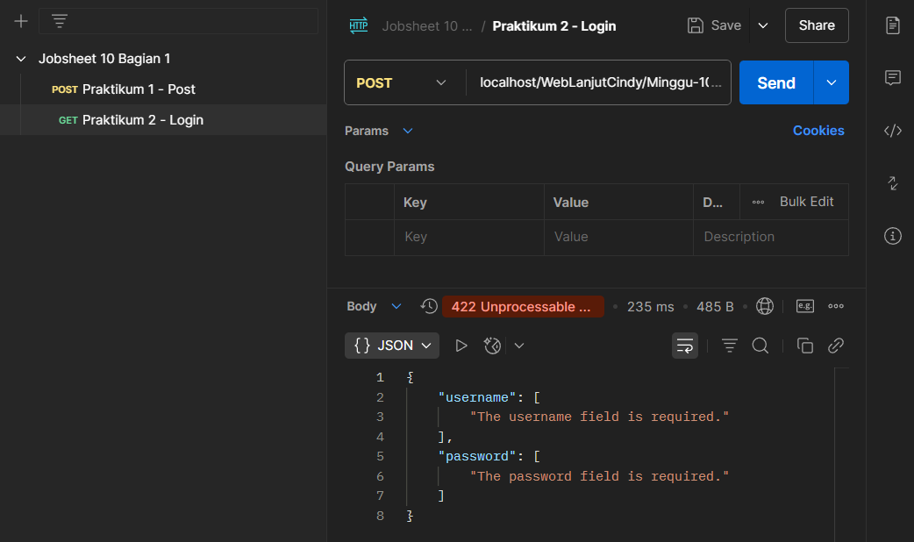
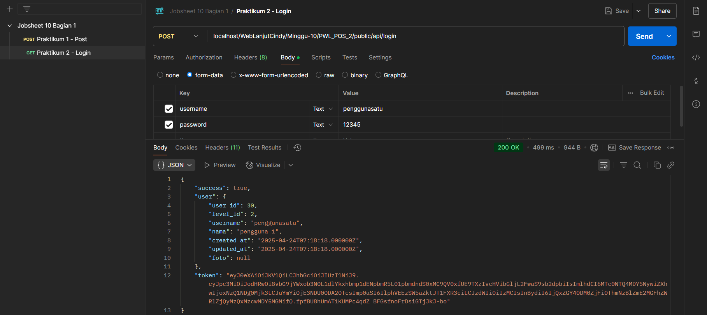
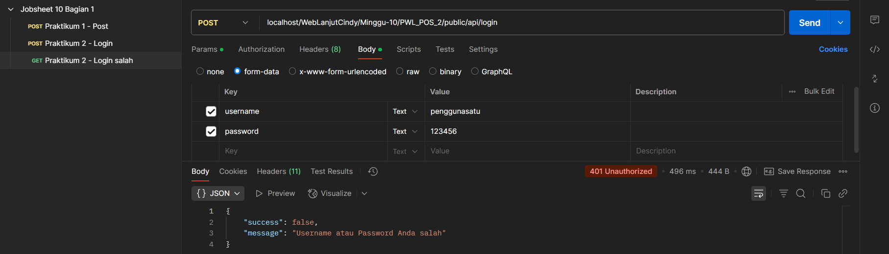
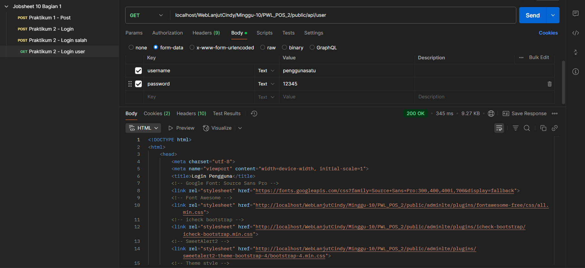

# Laporan Jobsheet Minggu ke-10
<b>Mata Kuliah : Pemrograman Web Lanjut</b>

<b>Program Studi : D4 - Teknik Informatika</b>

<b>Semester : 4</b>

<b>Kelas : TI 2A</b>

<b>NIM : 2341720038</b>

<b>Nama : Cindy Laili Larasati</b>

<b>Praktikum 1 - Membuat RESTful API Register<b>

    

    

<b>Praktikum 2 - Membuat RESTful API Login<b>

    

    

6. Lakukan percobaan yang untuk data yang salah dan berikan screenshoot hasil percobaan
Anda.

    

7. Coba kembali melakukan login dengan data yang benar. Sekarang mari kita coba
menampilkan data user yang sedang login menggunakan URL
localhost/PWL_POS/public/api/user dan method GET.

    

Kode HTML muncul karena kita akses API tanpa login dulu atau belum punya izin yang valid. Server anggap kita belum login, jadi langsung ngarahin ke halaman login, makanya yang muncul di Postman adalah tampilan HTML dari halaman login, bukan data JSON seperti yang kita harapkan.

