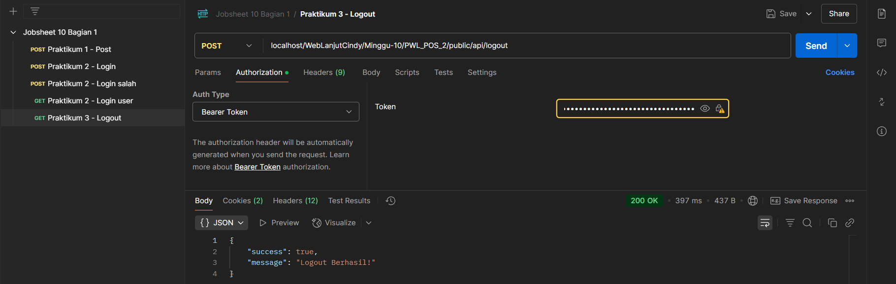
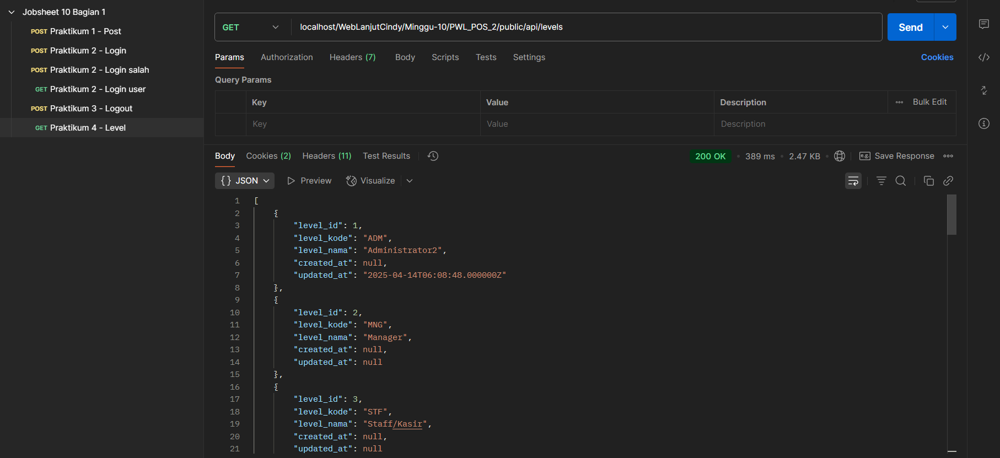
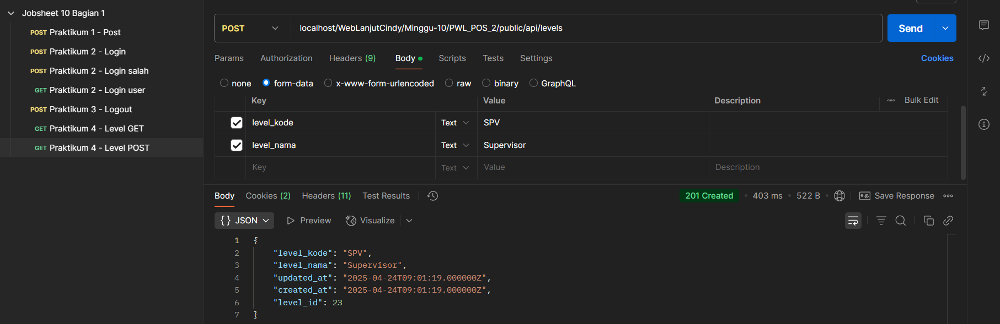
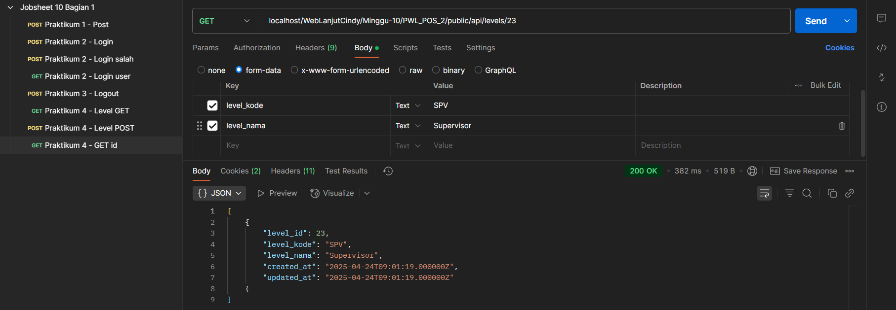
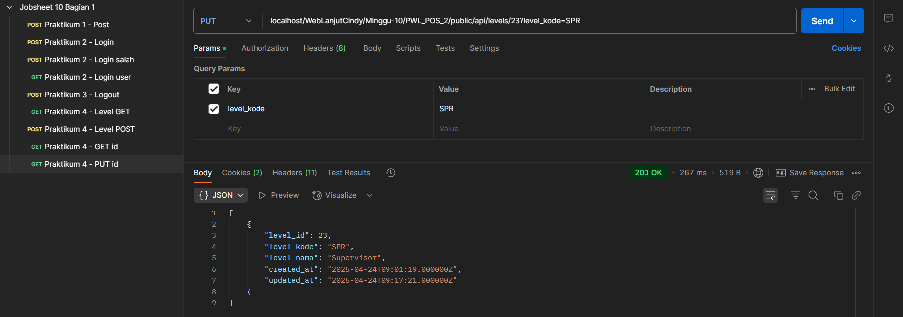
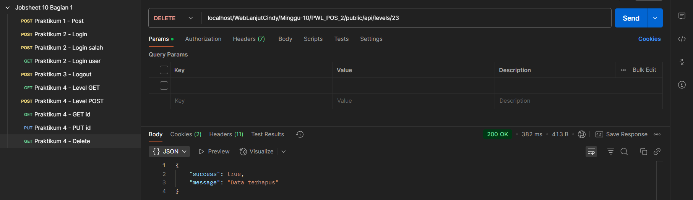

# Laporan Jobsheet Minggu ke-10
<b>Mata Kuliah : Pemrograman Web Lanjut</b>

<b>Program Studi : D4 - Teknik Informatika</b>

<b>Semester : 4</b>

<b>Kelas : TI 2A</b>

<b>NIM : 2341720038</b>

<b>Nama : Cindy Laili Larasati</b>

<b>Praktikum 1 - Membuat RESTful API Register<b>

    

    

<b>Praktikum 2 - Membuat RESTful API Login<b>

    

    

6. Lakukan percobaan yang untuk data yang salah dan berikan screenshoot hasil percobaan
Anda.

    

7. Coba kembali melakukan login dengan data yang benar. Sekarang mari kita coba
menampilkan data user yang sedang login menggunakan URL
localhost/PWL_POS/public/api/user dan method GET.

    

Kode HTML muncul karena kita akses API tanpa login dulu atau belum punya izin yang valid. Server anggap kita belum login, jadi langsung ngarahin ke halaman login, makanya yang muncul di Postman adalah tampilan HTML dari halaman login, bukan data JSON seperti yang kita harapkan.

<b>Praktikum 3 – Membuat RESTful API Logout<b>

    

<b>Praktikum 4 – Implementasi CRUD dalam RESTful API<b>

    

Menunjukkan bahwa kita berhasil ambil data level dari server karena sudah login sebelumnya. Respons yang muncul berupa data JSON yang berisi info level seperti Administrator, Manager, dan Staff/Kasir. Ini tandanya request kita diterima dengan baik (status 200 OK) dan kita punya izin akses.

    

6. Berikutnya lakukan percobaan menampilkan detail data.

    

Melakukan request GET ke endpoint levels/23, yang artinya kita mengambil data level berdasarkan ID, yaitu ID ke-23. Di bagian body terlihat bahwa level yang dimaksud memiliki kode "SPV" dan nama "Supervisor". Respons dari server menunjukkan data level tersebut berhasil diambil, ditandai dengan status 200 OK, serta muncul data JSON berisi informasi lengkap seperti level_id, level_kode, level_nama, dan waktu dibuat atau diubah. Hal ini menunjukkan bahwa data level dengan ID tersebut memang ada dan dapat diakses dengan benar melalui API.

    

Proses update data level menggunakan metode PUT pada Postman. Endpoint yang digunakan adalah levels/23, artinya kita mengupdate data level dengan ID 23. Parameter yang dikirimkan adalah level_kode dengan nilai baru yaitu "SPR", sedangkan data lainnya seperti level_nama tetap "Supervisor". Setelah permintaan dikirim, server merespons dengan status 200 OK, yang berarti permintaan berhasil diproses dan data berhasil diperbarui. Hal ini juga bisa terlihat dari nilai updated_at yang berubah ke waktu terbaru dibanding sebelumnya, menandakan bahwa memang telah terjadi perubahan data pada server.

    

Proses penghapusan data level melalui metode DELETE menggunakan Postman. Endpoint yang digunakan adalah localhost/WebLanjutCindy/Minggu-10/PWL_POS_2/public/api/levels/23, yang menunjukkan bahwa permintaan ini ditujukan untuk menghapus data level dengan level_id bernomor 23. Setelah permintaan dikirim, server memberikan respon dengan status 200 OK, yang berarti bahwa proses penghapusan berhasil dijalankan. Dalam isi respon juga terdapat nilai success: true dan message: "Data terhapus", yang menjadi konfirmasi bahwa data dengan ID tersebut benar-benar telah dihapus dari basis data. Ini adalah contoh penggunaan metode HTTP DELETE dalam operasi RESTful API untuk mengelola data.

