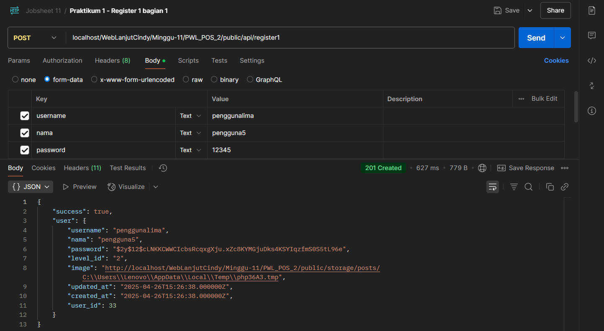

# Laporan Jobsheet Minggu ke-11
<b>Mata Kuliah : Pemrograman Web Lanjut</b>

<b>Program Studi : D4 - Teknik Informatika</b>

<b>Semester : 4</b>

<b>Kelas : TI 2A</b>

<b>NIM : 2341720038</b>

<b>Nama : Cindy Laili Larasati</b>

<b>Praktikum 1 - Membuat RESTful API Register<b>

Langkah 8

    

Langkah 10

    

Perbedaanya:

Saat menggunakan 'image' => $request->image, yang tersimpan di database adalah path file sementara dari komputer lokal (seperti C:\Users\Lenovo\AppData\Local\Temp), sehingga file bisa hilang setelah request selesai. Sedangkan saat menggunakan 'image' => $request->image->hashName(), gambar diupload dan disimpan permanen ke server dengan nama file unik di folder storage, sehingga URL gambar valid, file tidak hilang, dan bisa diakses kapan saja.

<b>Tugas - Implemetasi API di tabel Barang<b>

    

    

