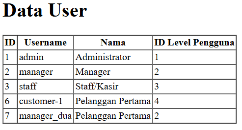
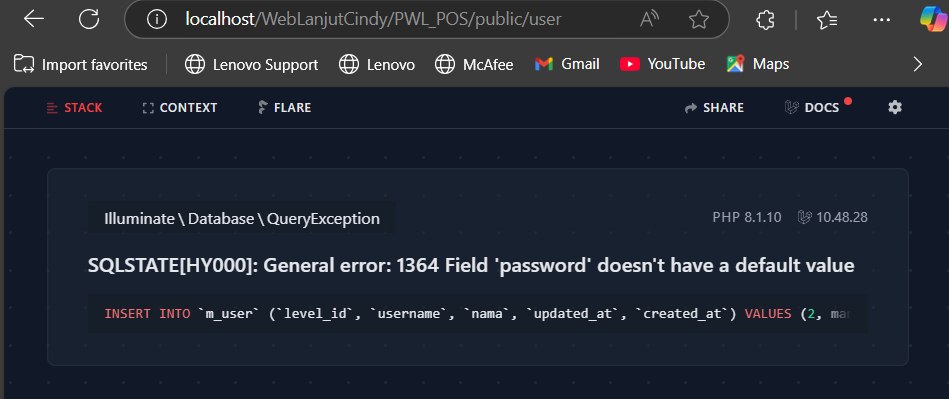
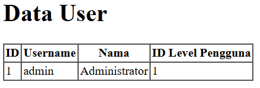
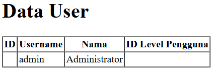
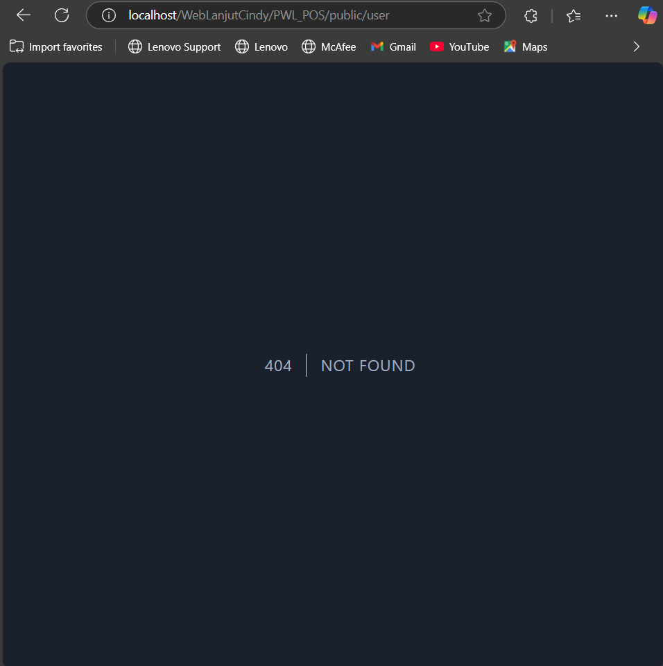
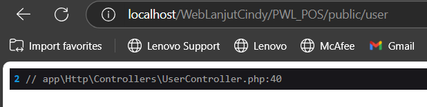
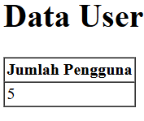

# Laporan Jobsheet Minggu ke-4 
<b>Mata Kuliah : Pemrograman Web Lanjut</b>

<b>Program Studi : D4 - Teknik Informatika</b>

<b>Semester : 4</b>

<b>Kelas : TI 2A</b>

<b>NIM : 2341720038</b>

<b>Nama : Cindy Laili Larasati</b>

<b>Praktikum 1 - $fillable</b>

langkah 3

    

langkah 6 

jika kolom di fillable di hapus maka akan seperti gambar di bawah

    

<b>Praktikum 2.1 - Retrieving Single Models</b>

langkah 3

    

langkah 5

    

langkah 7

    

langkah 9

    

langkah 11

    

<b>Praktikum 2.2 - Not Found Exceptions</b>

langkah 2

    

langkah 4

   

<b>Praktikum 2.3 - Retreiving Aggregrates</b>

langkah 2

    

langkah 3

   

