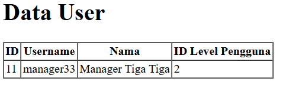

# Laporan Jobsheet Minggu ke-4 
<b>Mata Kuliah : Pemrograman Web Lanjut</b>

<b>Program Studi : D4 - Teknik Informatika</b>

<b>Semester : 4</b>

<b>Kelas : TI 2A</b>

<b>NIM : 2341720038</b>

<b>Nama : Cindy Laili Larasati</b>

<b>Praktikum 1 - $fillable</b>

langkah 3

Variabel $fillable berfungsi untuk mendefinisikan atribut atau nama kolom dalam tabel yang dapat diisi secara langsung ketika melakukan proses penyimpanan (insert) atau pembaruan (update) data ke dalam database.

    

langkah 6 

jika kolom di fillable di hapus maka akan seperti gambar di bawah

    

<b>Praktikum 2.1 - Retrieving Single Models</b>

langkah 3

 Saat program dijalankan di browser, halaman web akan menampilkan tabel yang berisi informasi pengguna dengan user_id = 1. Jika data tersebut ada di database, maka informasi akan muncul dengan benar sesuai yang diharapkan.

    

langkah 5

Ketika dijalankan di browser, kedua kode tersebut akan menampilkan data pengguna yang memiliki level_id = 1. Jika data tersedia, informasi pengguna pertama yang sesuai akan ditampilkan dalam tabel. Baik metode where('level_id', 1)->first() maupun firstWhere('level_id', 1) memberikan hasil yang sama, yaitu mengambil satu baris pertama yang sesuai dari database.

    

langkah 7

Ketika dijalankan di browser, program akan mencari data pengguna dengan user_id = 1

    

langkah 9

Saat dijalankan di browser, program akan mencari data pengguna dengan user_id = 1. Jika data ditemukan, hanya kolom username dan nama yang akan ditampilkan dalam tabel. 

    

langkah 11

Ketika dijalankan di browser, program akan mencari data pengguna dengan user_id = 20. Jika data tersedia, hanya informasi pada kolom username dan nama yang akan ditampilkan dalam tabel. Namun, jika data tidak ditemukan, sistem secara otomatis akan menampilkan halaman error 404 karena adanya fungsi abort(404)

    

<b>Praktikum 2.2 - Not Found Exceptions</b>

langkah 2

Ketika dijalankan di browser, program akan mencari data pengguna dengan user_id = 1. Jika data tersedia, informasi pengguna akan ditampilkan dalam tabel. Namun, jika data tidak ditemukan, sistem secara otomatis akan menampilkan error 404 karena metode findOrFail(1) akan langsung menghentikan proses dan menampilkan error jika data yang dicari tidak ditemukan dalam database.

    

langkah 4

Saat dijalankan di browser, program akan mencari data pengguna dengan username = 'manager9'. Jika data ditemukan, informasi pengguna tersebut akan ditampilkan dalam tabel. Namun, jika data tidak ditemukan, sistem akan otomatis menampilkan error 404 karena metode firstOrFail() akan langsung menghentikan proses dan memunculkan error jika data yang dicari tidak tersedia dalam database.

   

<b>Praktikum 2.3 - Retreiving Aggregrates</b>

langkah 2

Ketika dijalankan di browser, program akan menghitung jumlah pengguna yang memiliki level_id = 2 menggunakan metode count(). Namun, karena terdapat fungsi dd($user), proses akan terhenti seperti pada gambar di bawah

    

langkah 3
setelah di modifikasi maka akan muncul seperti gambar berikut

   

<b>Praktikum 2.4 - Retreiving Aggregrates</b>

langkah 3

Saat dijalankan di browser, program akan mencari data pengguna dengan username = 'manager' dan nama = 'Manager'. Jika data tersebut sudah ada di database, maka data yang ditemukan akan ditampilkan dalam tabel. 

    

langkah 5

Ketika dijalankan di browser, program akan mencari data pengguna dengan username = 'manager22' dan nama = 'Manager Dua Dua'. Jika data tersebut sudah ada dalam database, maka sistem akan menampilkan data yang ditemukan. 

    

langkah 7

Ketika dijalankan di browser, program akan mencari data pengguna dengan username = 'manager' dan nama = 'Manager'. Jika data sudah ada, maka akan ditampilkan.

    

langkah 9

Saat dijalankan di browser, program akan mencari pengguna dengan username = 'manager33' dan nama = 'Manager Tiga Tiga'. Jika data ditemukan, maka akan ditampilkan.

    

langkah 11

Saat dijalankan di browser, program akan mencari pengguna dengan username = 'manager33' dan nama = 'Manager Tiga Tiga'. Jika data sudah ada, maka akan ditampilkan. Jika belum ada, sistem akan membuat pengguna baru dan langsung menyimpannya ke database menggunakan $user->save(), sehingga data akan tersimpan secara permanen.

    

     

<b>Praktikum 2.5 – Attribute Changes</b>

langkah 2

Saat dijalankan di browser, program akan membuat pengguna baru dengan username = 'manager55', lalu mengubahnya menjadi manager56. Sebelum data disimpan, isDirty() mendeteksi perubahan pada atribut yang diubah, sementara isClean() memastikan atribut yang tidak berubah. Setelah data disimpan dengan $user->save(), isDirty() menjadi false dan isClean() menjadi true, lalu program menampilkan false karena tidak ada perubahan lagi.

    

langkah 4

Saat dijalankan di browser, program akan membuat pengguna baru dengan username = 'manager11', lalu mengubahnya menjadi manager12. Setelah disimpan, metode wasChanged() akan mendeteksi perubahan pada username, sedangkan nama tetap sama. Program kemudian menampilkan true karena ada perubahan pada username.

    

<b>Praktikum 2.6 – Create, Read, Update, Delete (CRUD)</b>

langkah 3

Saat dijalankan di browser, halaman akan menampilkan daftar pengguna dalam tabel. Jika ada data di database, informasi seperti ID, username, nama, dan level pengguna akan ditampilkan. Tersedia juga opsi untuk mengubah atau menghapus data. 

    

langkah 7

Saat dijalankan di browser, halaman akan menampilkan formulir untuk menambahkan data pengguna baru. Pengguna dapat mengisi username, nama, password, dan level ID, lalu menekan tombol "Simpan".

    

langkah 10

Saat dijalankan di browser, pengguna dapat mengisi formulir tambah user dan mengirimkan data. Setelah submit, data akan disimpan ke database dengan password yang telah dienkripsi menggunakan Hash::make().

    

langkah 14

Saat dijalankan di browser, halaman akan menampilkan formulir untuk mengubah data pengguna berdasarkan user_id yang dipilih. Data pengguna yang sudah ada akan otomatis terisi di dalam formulir. Setelah perubahan dilakukan dan formulir disubmit, data akan dikirim ke route /user/ubah_simpan/{id} untuk diperbarui di database.

    

langkah 17

Saat dijalankan di browser, program akan memperbarui data pengguna berdasarkan user_id yang dipilih. Setelah formulir diubah dan disubmit, data baru akan disimpan ke database. Password juga akan dienkripsi ulang dengan Hash::make(). 

    

langkah 20

Saat dijalankan di browser, program akan menghapus data pengguna berdasarkan user_id yang dipilih. Ketika tautan "Hapus" diklik, sistem akan mencari data pengguna dengan ID tersebut, lalu menghapusnya dari database. 

    

<b>Praktikum 2.7 – Relationships</b>

langkah 3

Saat dijalankan di browser, program akan mengambil semua data pengguna dari tabel m_user beserta informasi levelnya melalui relasi belongsTo dengan LevelModel.

    

langkah 6

Saat dijalankan di browser, program akan menampilkan daftar pengguna dalam bentuk tabel. Data yang ditampilkan mencakup ID pengguna, username, nama, ID level pengguna, kode level, dan nama level.Karena pada controller UserModel::with('level')->get(); digunakan, maka sistem akan mengambil data pengguna beserta informasi levelnya melalui relasi belongsTo dengan LevelModel.

    

