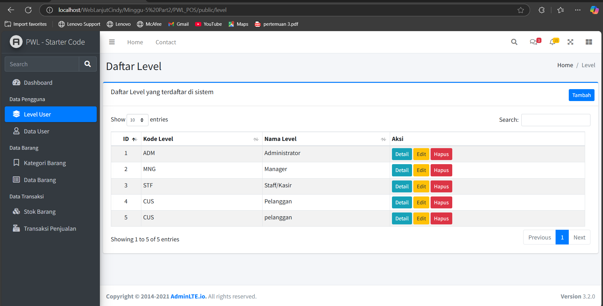

# Laporan Jobsheet Minggu ke-5 Part 2
<b>Mata Kuliah : Pemrograman Web Lanjut</b>

<b>Program Studi : D4 - Teknik Informatika</b>

<b>Semester : 4</b>

<b>Kelas : TI 2A</b>

<b>NIM : 2341720038</b>

<b>Nama : Cindy Laili Larasati</b>

<b>Praktikum 1 – Layouting AdminLTE<b>

langkah 3

    

<b>Praktikum 2 – Penerapan Layouting</b>

    

<b>Praktikum 3 – Implementasi jQuery Datatable di AdminLTE</b>

langkah 2

    

langkah 12

Tambah user

    

langkah 16

    

langkah 21

Edit user

    

langkah 24

Hapus user

    

    

<b>Praktikum 4 – Implementasi Filtering Datatables</b>

    

<b>- Tugas Praktikum -</b>

    

    

    

    
