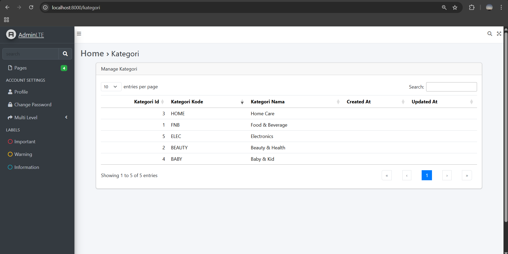

# Laporan Jobsheet Minggu ke-5 
<b>Mata Kuliah : Pemrograman Web Lanjut</b></p>
<b>Program Studi : D4 - Teknik Informatika</b></p>
<b>Semester : 4</b>
<hr>
<b>Kelas : TI 2A</b></p>
<b>NIM : 2341720038</b></p>
<b>Nama : Cindy Laili Larasati</b>
<hr>

<b>Praktikum 1 – Integrasi Laravel dengan AdminLte3<b>
<p>langkah 5</p>
<p>tampilan dari view welcome.blade.php</p>
<p align="center">
    </p>
<hr>

<b>Praktikum 2 – Integrasi dengan DataTables</b></p>
<p>langkah 16</p>
<p>tampilan pada halaman kategori yang sudah terintegrasi dengan database. maka tampilan di web akan sesuai dengan isi database pada m_kategori</p>
<p align="center">
    </p>
    </p>
<hr>

<b>Praktikum 3 – Membuat form kemudian menyimpan data dalam database</b></p>
<p>langkah 5</p>
<p>Hasil /kategori/create :</p>
<p align="center">
    </p>
<p>langkah 6
<p>Hasil /kategori :</p>
<p align="center">
    </p>
<hr>
 
 <b>- Tugas Praktikum -</b></p>
<p>1. Tambahkan button Add di halam manage kategori, yang mengarah ke create kategori
baru</p>

```
    <div class="card-header d-flex justify-content-between align-items-center">
                <span>Manage Kategori</span>
                <a href="{{ url('kategori/create') }}" class="btn btn-primary ms-auto">Add</a>
            </div>
```
<p align="center">
    </p>

<p>2. Tambahkan menu untuk halaman manage kategori, di daftar menu navbar</p>

```
     'menu' => [
        // Navbar items:
        [
            'type' => 'navbar-search',
            'text' => 'search',
            'topnav_right' => true,
        ],
        [
            'text' => 'Manage Kategori', // add navbar manage kategori
            'url' => '/kategori',
            'icon' => 'fas fa-folder',
            'topnav' => true,
        ],
        [
            'type' => 'fullscreen-widget',
            'topnav_right' => true,
        ],

<p align="center">
    </p>

<p>3. Tambahkan action edit di datatables dan buat halaman edit serta controllernya</p>

```
    public function dataTable(QueryBuilder $query): EloquentDataTable
        {
            return (new EloquentDataTable($query))
                ->addColumn('action', function ($row) {
                    $editUrl = url('/kategori/edit', $row->kategori_id);
                    $deleteUrl = url('/kategori/delete', $row->kategori_id);
                    $csrfToken = csrf_token();

                    return '
                    <div class="btn-group gap-2" role="group">
                    <a href="' . $editUrl . '" class="btn btn-warning btn-sm d-flex align-items-center">
                        Edit
                    </a>
                    <form action="' . $deleteUrl . '" method="POST" style="display:inline;">
                        <input type="hidden" name="_method" value="POST">
                        <input type="hidden" name="_token" value="' . $csrfToken . '">
                        <button type="submit" class="btn btn-danger btn-sm d-flex align-items-center"
                            onclick="return confirm(\'Yakin ingin menghapus?\')">
                                Delete
                        </button>
                    </form>
                </div>
                ';
                })
                ->rawColumns(['action'])
                ->setRowId('id');
        }

```
    public function edit($id)
        {
            $kategori = KategoriModel::findOrFail($id);
            return view('kategori.edit', compact('kategori'));
        }
    
        public function update(Request $request, $id)
        {
            $request->validate([
                'kategori_kode' => 'required|string|max:10',
                'kategori_nama' => 'required|string|max:100',
            ]);
    
            $kategori = KategoriModel::findOrFail($id);
            $kategori->update([
                'kategori_kode' => $request->kategori_kode,
                'kategori_nama' => $request->kategori_nama,
            ]);
    
            return redirect('/kategori');
        }
```

<p align="center">
    </p>
    </p>


<p>4. Tambahkan action delete di datatables serta controllernya</p>

```
public function dataTable(QueryBuilder $query): EloquentDataTable
    {
        return (new EloquentDataTable($query))
            ->addColumn('action', function ($row) {
                $editUrl = url('/kategori/edit', $row->kategori_id);
                $deleteUrl = url('/kategori/delete', $row->kategori_id);
                $csrfToken = csrf_token();

                return '
                <div class="btn-group gap-2" role="group">
                <a href="' . $editUrl . '" class="btn btn-warning btn-sm d-flex align-items-center">
                     Edit
                </a>
                <form action="' . $deleteUrl . '" method="POST" style="display:inline;">
                    <input type="hidden" name="_method" value="POST">
                    <input type="hidden" name="_token" value="' . $csrfToken . '">
                    <button type="submit" class="btn btn-danger btn-sm d-flex align-items-center"
                        onclick="return confirm(\'Yakin ingin menghapus?\')">
                            Delete
                    </button>
                </form>
            </div>
            ';
            })
            ->rawColumns(['action'])
            ->setRowId('id');
    }

```
    public function destroy($id)
        {
            $kategori = KategoriModel::findOrFail($id);
            $kategori->delete();

            return redirect('/kategori');
        }

<p align="center">
    </p>
    </p>
<hr>