# Laporan Jobsheet Minggu ke-7
<b>Mata Kuliah : Pemrograman Web Lanjut</b>

<b>Program Studi : D4 - Teknik Informatika</b>

<b>Semester : 4</b>

<b>Kelas : TI 2A</b>

<b>NIM : 2341720038</b>

<b>Nama : Cindy Laili Larasati</b>

<b>Praktikum 1 - Implementasi Authentication<b>

    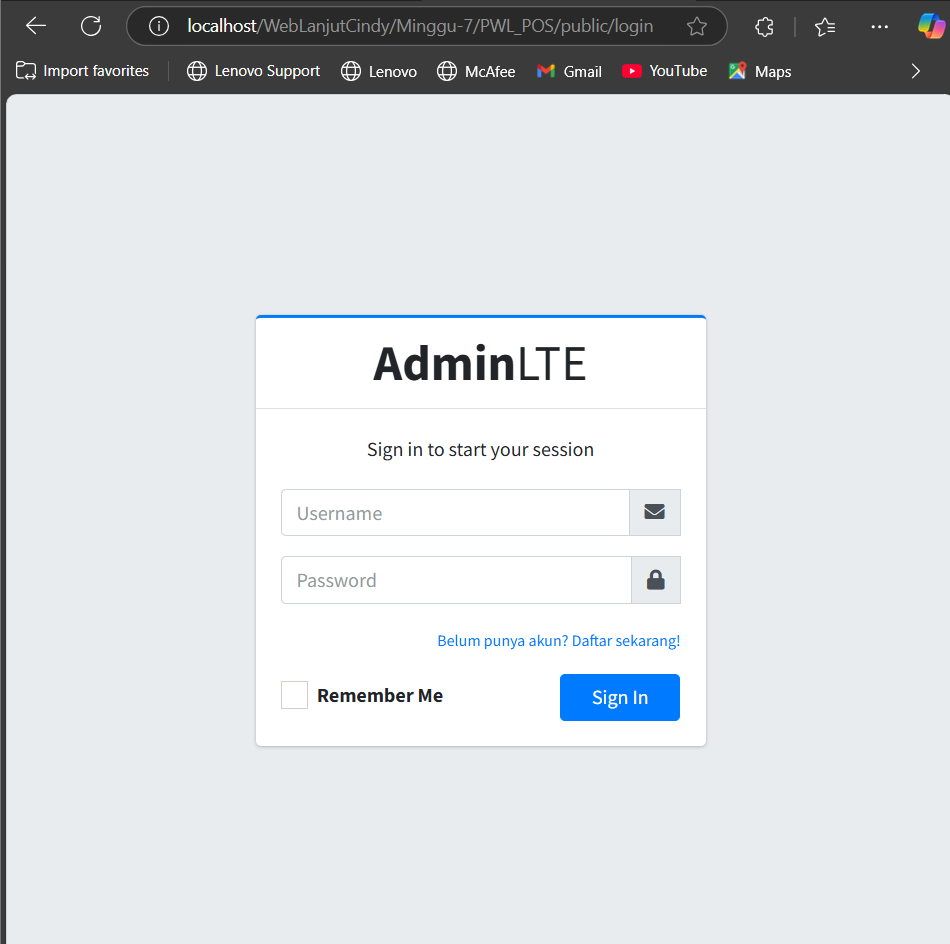

<b>Tugas 1 -  Implementasi Authentication</b>

1. Silahkan implementasikan proses login pada project kalian masing-masing

2. Silahkan implementasi proses logout pada halaman web yang kalian buat
 

jawab :

Tambahkan kode program di bawah ini pada layouts/sidebar.blade.php

    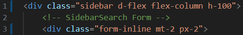

    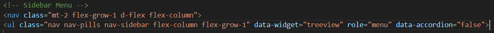

    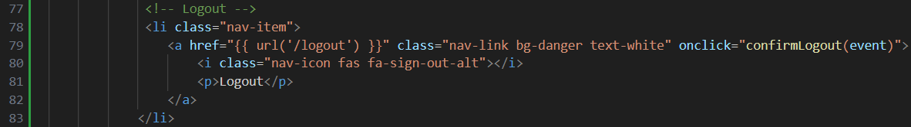

    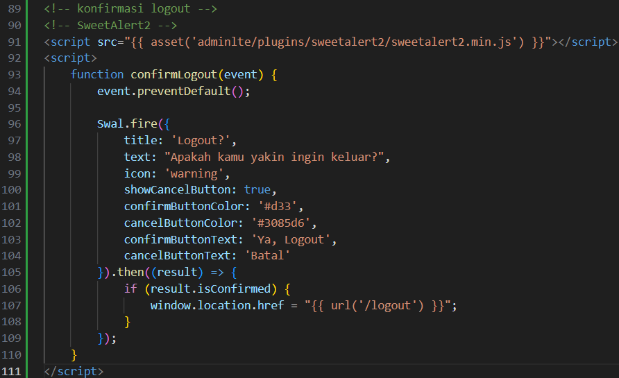

Lalu tambahkan route pada web.php seperti di bawah ini

    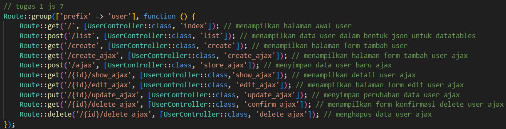

Lalu akan muncul tombol logout pada php yang akan diarahkan ke halaman login
kembali

    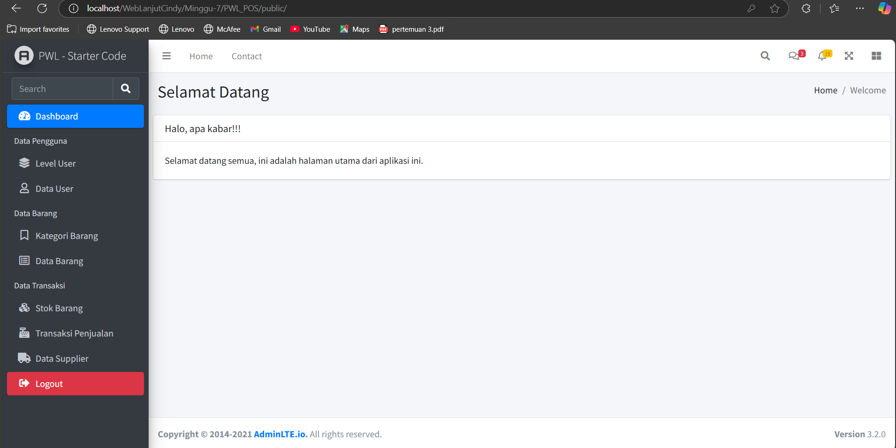

<b>Praktikum 2 - Implementasi Authorizaton di Laravel dengan Middleware</b>

Jika login sebagai admin dapat mengakses halaman level user

    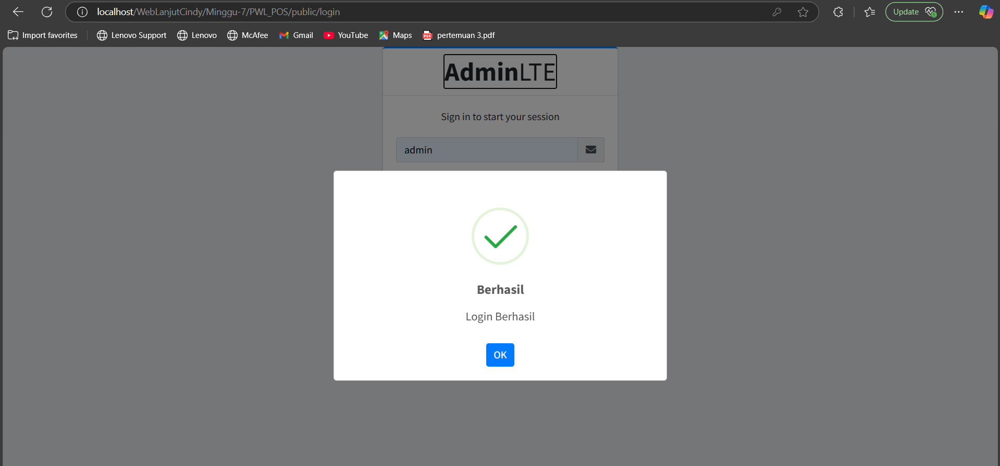

    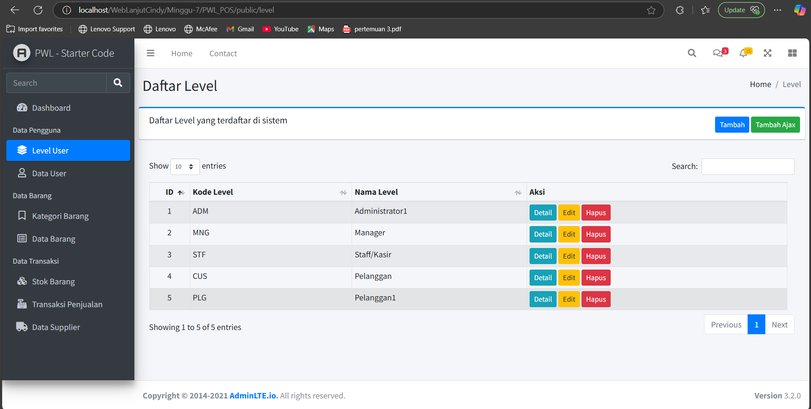

Jika login sebagai selain admin maka tidak dapat mengakses halaman level user

    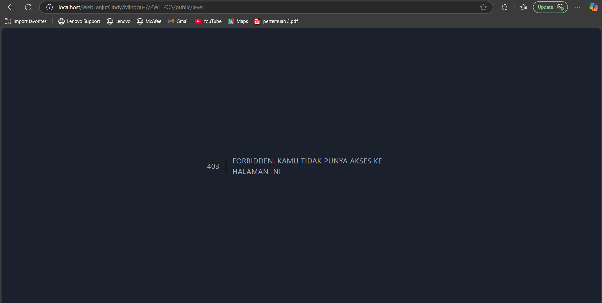

    
<b>Praktikum 3 - Implementasi Multi-Level Authorizaton di Laravel dengan Middleware</b>

    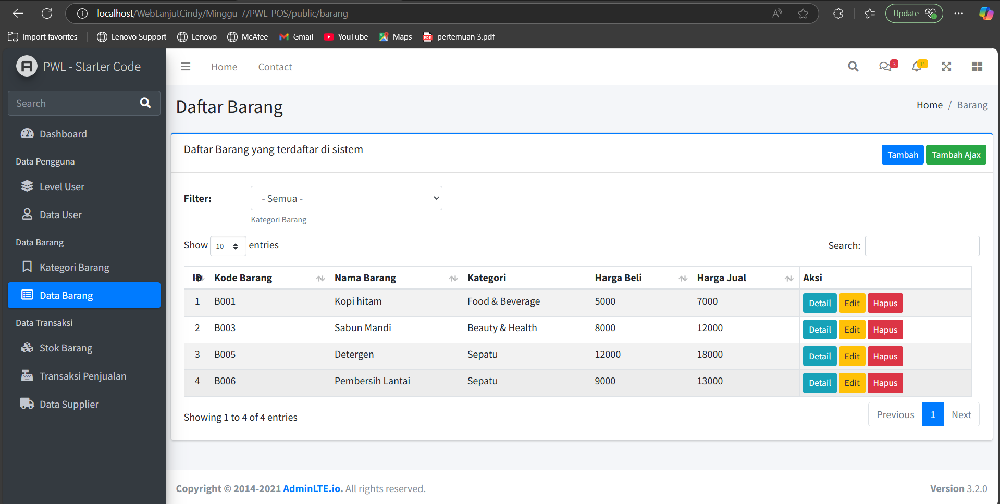

    