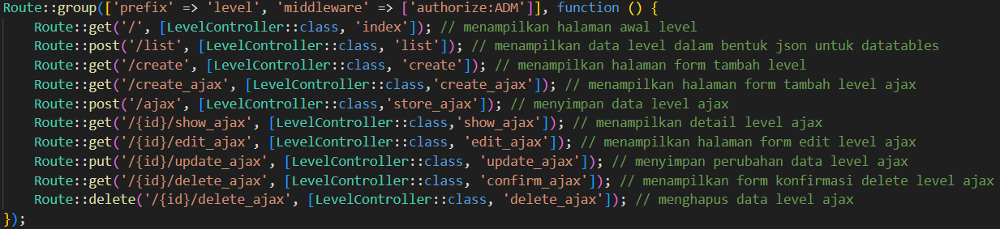

# Laporan Jobsheet Minggu ke-7
<b>Mata Kuliah : Pemrograman Web Lanjut</b>

<b>Program Studi : D4 - Teknik Informatika</b>

<b>Semester : 4</b>

<b>Kelas : TI 2A</b>

<b>NIM : 2341720038</b>

<b>Nama : Cindy Laili Larasati</b>

<b>Praktikum 1 - Implementasi Authentication<b>

    

<b>Tugas 1 - Implementasi Authentication</b>

1. Silahkan implementasikan proses login pada project kalian masing-masing

2. Silahkan implementasi proses logout pada halaman web yang kalian buat
 

jawab :

Tambahkan kode program di bawah ini pada layouts/sidebar.blade.php

    

    

    

    

Lalu tambahkan route pada web.php seperti di bawah ini

    

Lalu akan muncul tombol logout pada php yang akan diarahkan ke halaman login
kembali

    

<b>Praktikum 2 - Implementasi Authorizaton di Laravel dengan Middleware</b>

Jika login sebagai admin dapat mengakses halaman level user

    

    

Jika login sebagai selain admin maka tidak dapat mengakses halaman level user

    

<b>Tugas 2 - Implementasi Authoriization</b>

1. Apa yang kalian pahami pada praktikum 2 ini?

jawab :

- Mengontrol akses ke halaman tertentu sesuai dengan peran pengguna (seperti admin, kasir, dan sebagainya).

- Meningkatkan keamanan aplikasi dengan menambahkan middleware otorisasi (AuthorizeUser).

<b>Praktikum 3 - Implementasi Multi-Level Authorizaton di Laravel dengan Middleware</b>

    

<b>Tugas 3 - Implementasi Multi-Level Authorization</b>

1. Silahkan implementasikan multi-level authorization pada project kalian masing-masing

3. Implementasikan multi-level authorization untuk semua Level/Jenis User dan Menu - menu yang sesuai dengan Level/Jenis User

jawab : 

Modifikasi pada route untuk implementasi multi-level auth

    

    

    

    

    

<b>Tugas 4 - Implementasi Form Registrasi</b>

1. Silahkan implementasikan form untuk registrasi user. 

jawab : 

- tambahkan function register pada AuthController.php

    

    

    

- buat file register.blade.php di dalam folder resources/views/auth

    

- tambahkan kode pada routes

    

2. Screenshot hasil yang kalian kerjakan

jawab : 

    

    

