# Laporan Jobsheet Minggu ke-8
<b>Mata Kuliah : Pemrograman Web Lanjut</b>

<b>Program Studi : D4 - Teknik Informatika</b>

<b>Semester : 4</b>

<b>Kelas : TI 2A</b>

<b>NIM : 2341720038</b>

<b>Nama : Cindy Laili Larasati</b>

<b>Praktikum 1 - Implementasi Upload File untuk import data<b>

    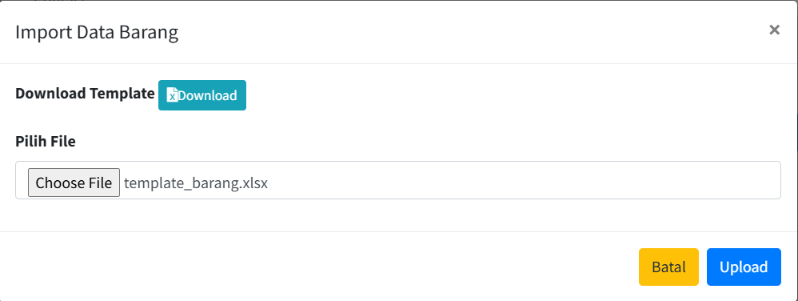

<b>Tugas 1 - Implementasi File Upload untuk Import Data<b>

1. Silahkan implementasikan praktikum 1 pada project kalian masing-masing untuk semua 
menu 

jawab :

- level

    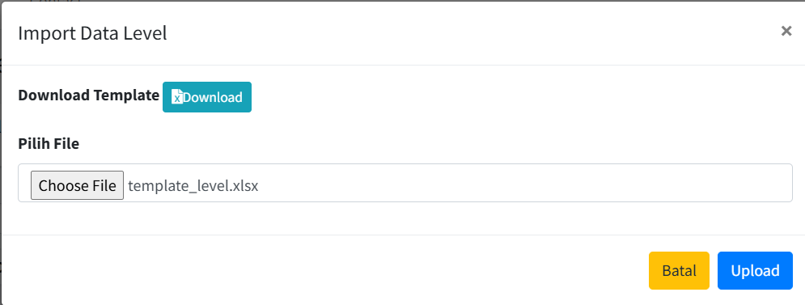

    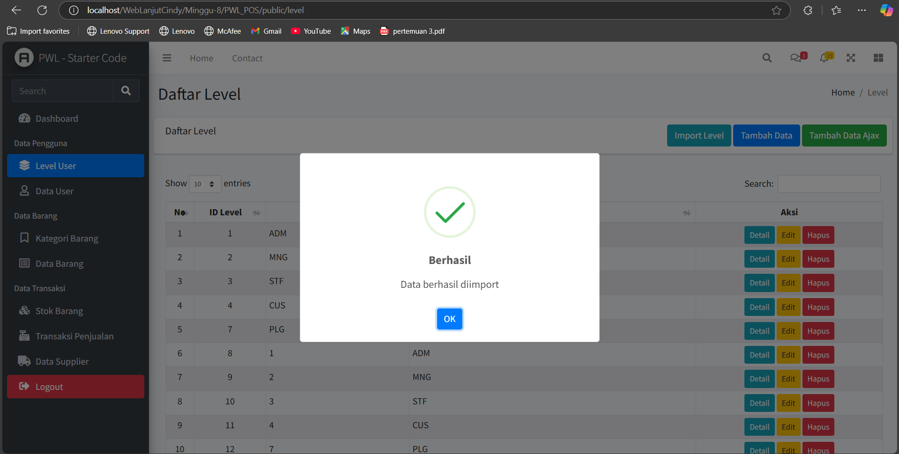

- User

    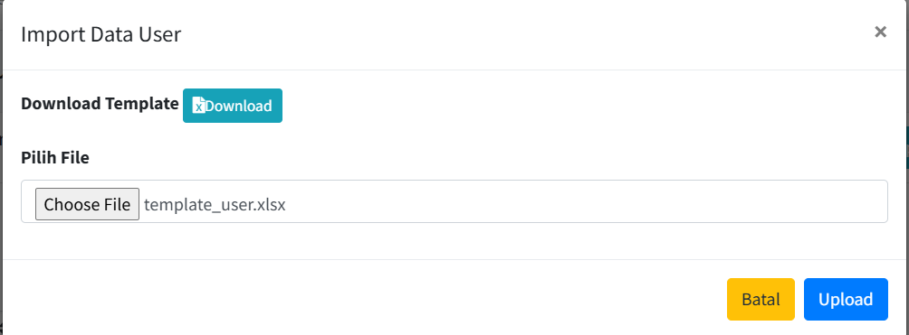

    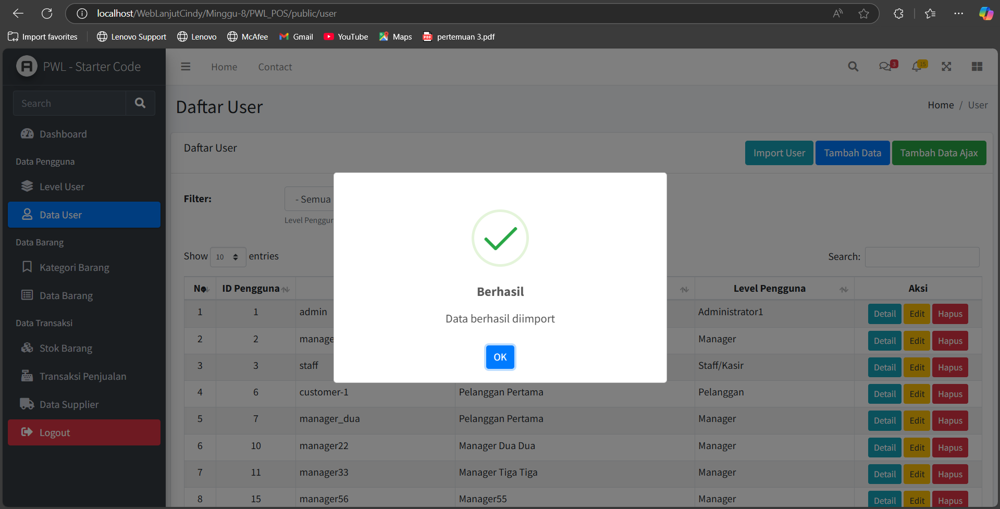

- Kategori

    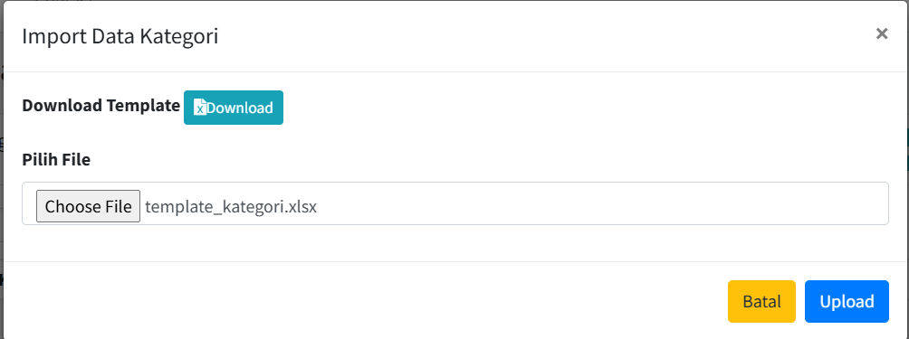

    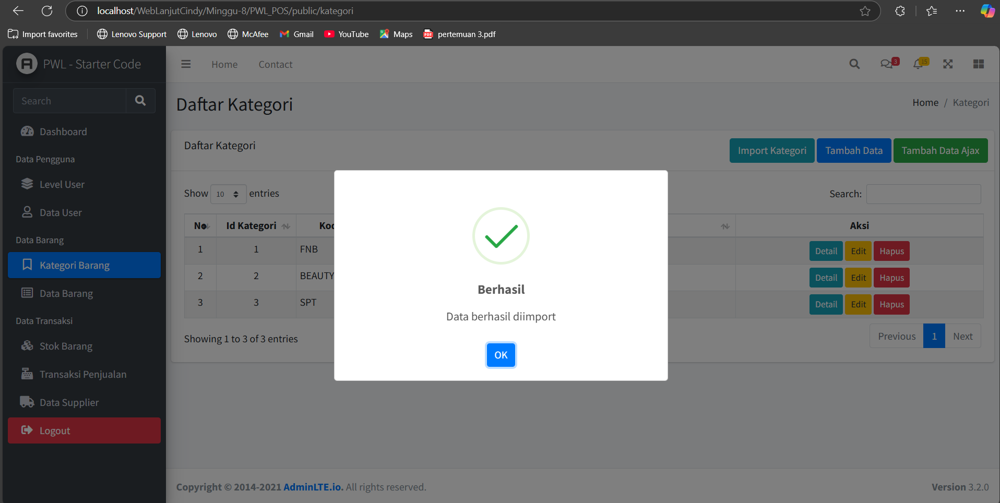

- Supplier

    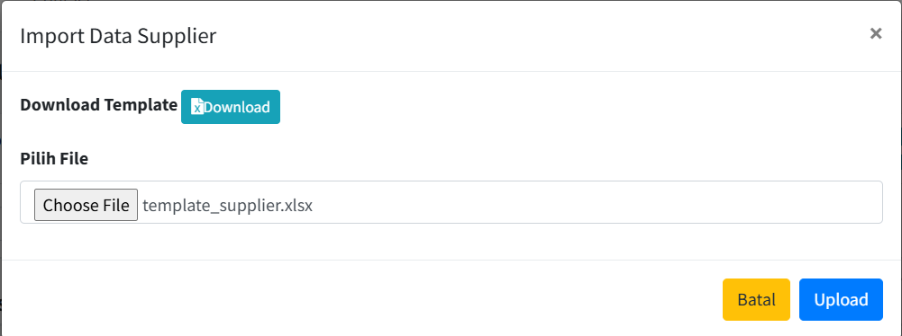

    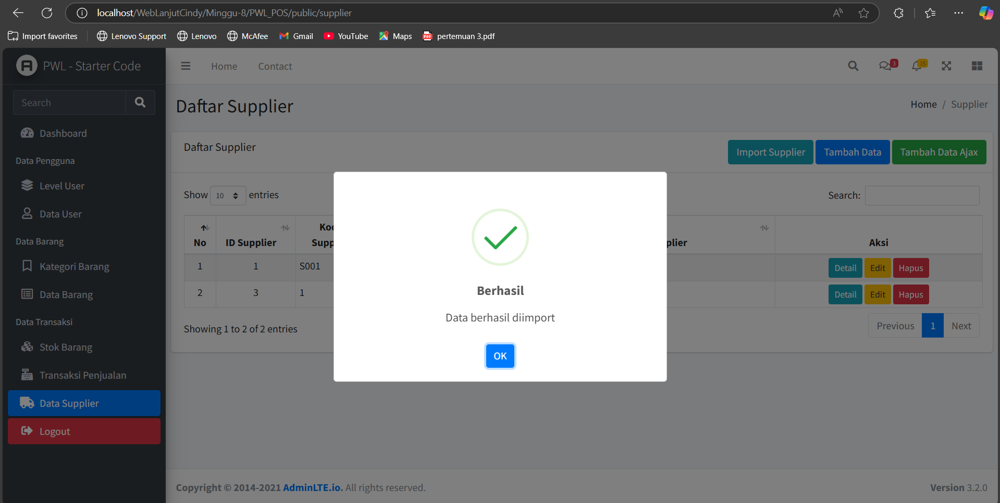

<b>Praktikum 2 – Export Data ke Excel <b>

    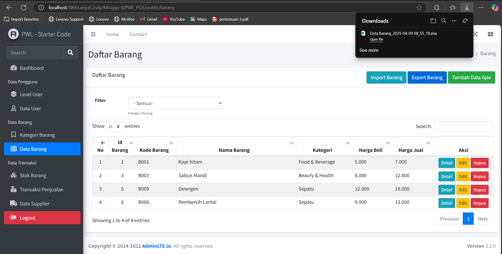

<b>Tugas 2 – Implementasi File Export Excel<b>

1. Silahkan implementasikan praktikum 2 pada project kalian masing-masing untuk semua 
menu

jawab :

- level

    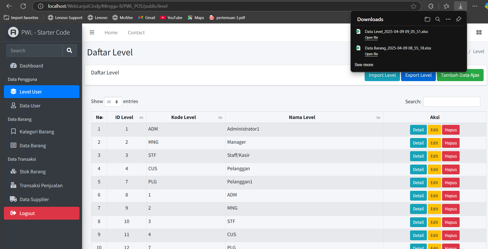

- User

    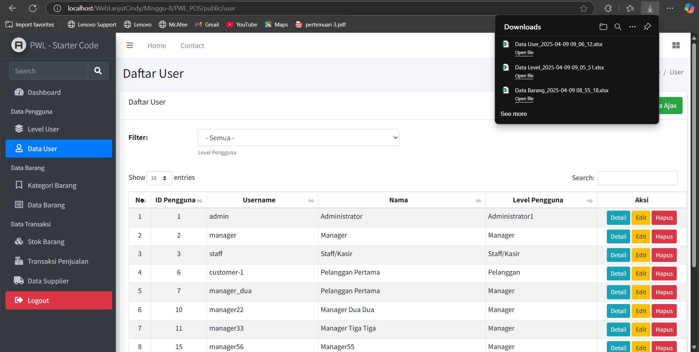

- Kategori

    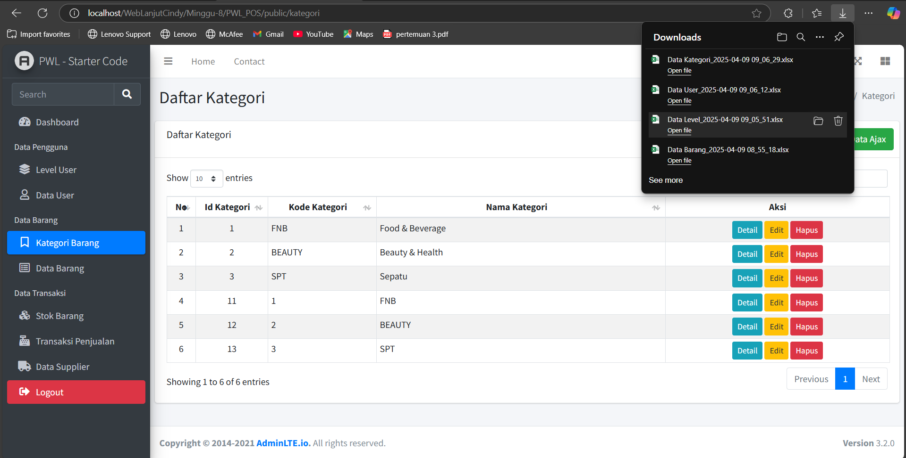

- Supplier

    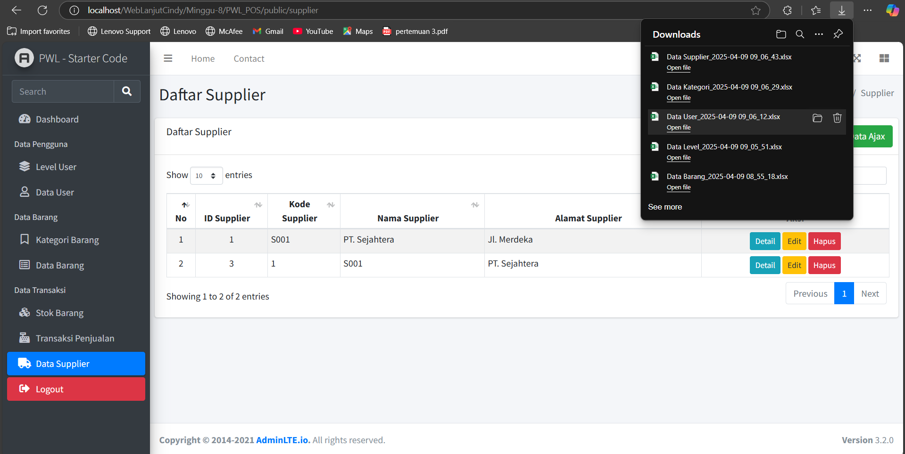

